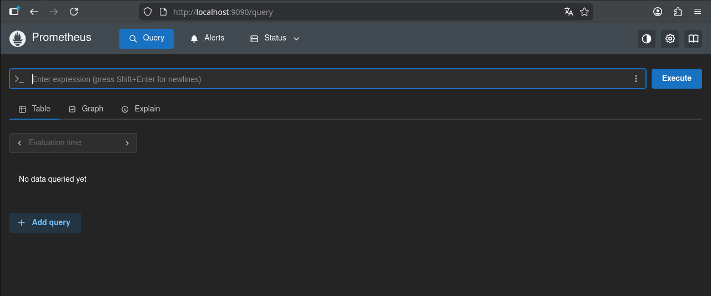
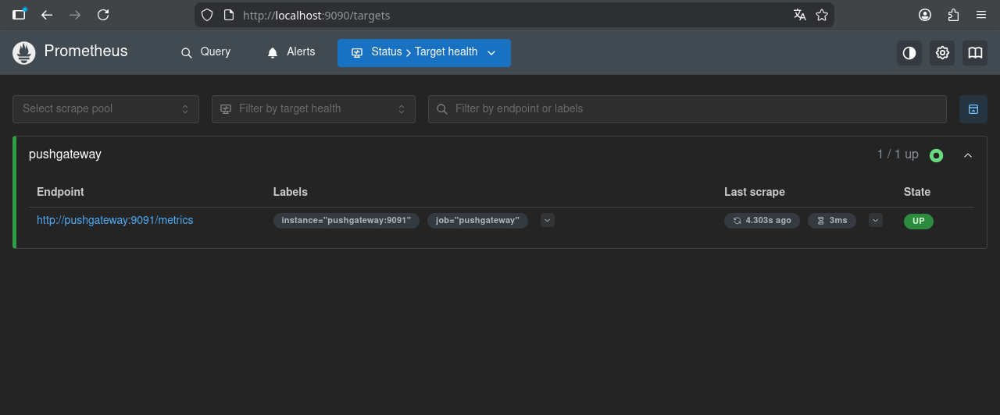
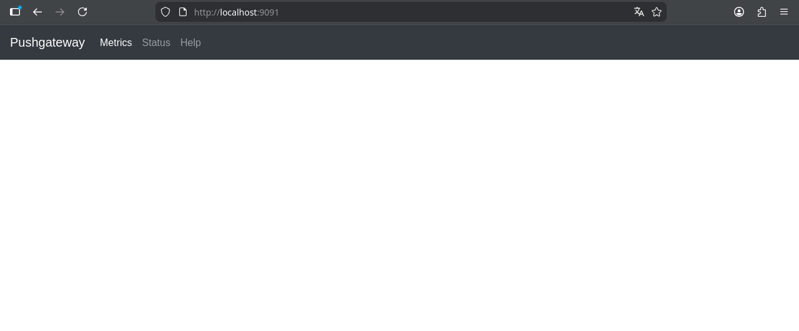
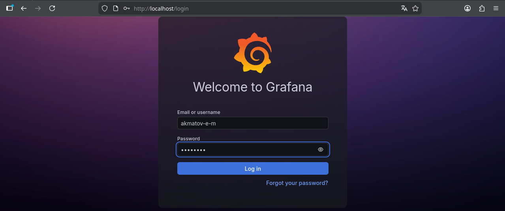
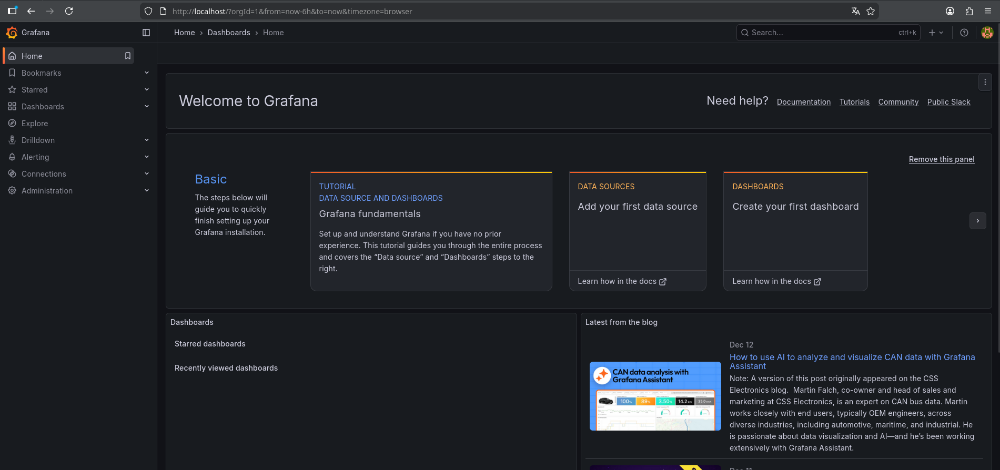
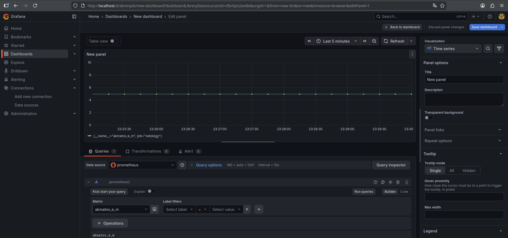
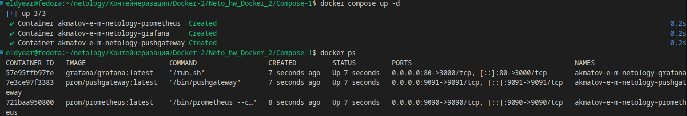
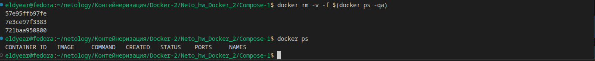

# Домашнее задание к занятию "`Docker. Часть 2`" - `Элдияр Акматов`


### Задание 1

`Docker Compose — это инструмент для оркестрации многоконтейнерных приложений, позволяющий описать всю инфраструктуру (сервисы, сети, тома) в одном файле docker-compose.yml и запускать её одной командой. Лично мою жизнь он упрощает тем, что избавляет от необходимости вручную вводить длинные команды docker run с десятками флагов для каждого компонента проекта. Вместо того чтобы по отдельности поднимать базу данных PostgreSQL, бэкенд на Django и веб-сервер Nginx, я могу развернуть готовую среду разработки за считанные секунды, гарантируя, что она будет идентична на любом компьютере.`

### Задание 2


```yml
version: '3.8'
services:
  # Пока здесь будет заглушка, так как в задании 2 нужны только первичные настройки
  placeholder-app:
    image: alpine
    command: sleep infinity
    networks:
      - my_network

networks:
  my_network:
    name: Akmatov_E_M-my-netology-hw
    driver: bridge
    ipam:
      driver: default
      config:
        - subnet: 10.5.0.0/16

volumes:
  db_data: {}
  static_content: {}
```

```bash
eldyear@fedora:~/netology/Контейнеризация/Docker-2/Neto_hw_Docker_2/Compose-1$ docker compose up -d
WARN[0000] /home/eldyear/netology/Контейнеризация/Docker-2/Neto_hw_Docker_2/Compose-1/compose.yml: the attribute `version` is obsolete, it will be ignored, please remove it to avoid potential confusion 
[+] up 2/2
 ✔ Network Akmatov_E_M-my-netology-hw    Created                                                                                                      0.1s
 ✔ Container compose-1-placeholder-app-1 Created                                                                                                      0.2s
eldyear@fedora:~/netology/Контейнеризация/Docker-2/Neto_hw_Docker_2/Compose-1$ docker network inspect Akmatov_E_M-my-netology-hw 
[
    {
        "Name": "Akmatov_E_M-my-netology-hw",
        "Id": "baee62d26c8af3cbfb937ca528a4eb8d1708b7ee9472def5c319990cb7729dab",
        "Created": "2026-01-30T21:17:57.834680249+06:00",
        "Scope": "local",
        "Driver": "bridge",
        "EnableIPv4": true,
        "EnableIPv6": false,
        "IPAM": {
            "Driver": "default",
            "Options": null,
            "Config": [
                {
                    "Subnet": "10.5.0.0/16",
                    "Gateway": "10.5.0.1"
                }
            ]
        },
        "Internal": false,
        "Attachable": false,
        "Ingress": false,
        "ConfigFrom": {
            "Network": ""
        },
        "ConfigOnly": false,
        "Options": {},
        "Labels": {
            "com.docker.compose.config-hash": "954bb21ddd2eb48ba06afbce0c9a281146c7aa086b1c952f627760f789ded7bc",
            "com.docker.compose.network": "my_network",
            "com.docker.compose.project": "compose-1",
            "com.docker.compose.version": "5.0.2"
        },
        "Containers": {
            "f7f057a72f614a81a8cae6e510c1853a718c7c787a1e80ab9a7e5e10bef72d95": {
                "Name": "compose-1-placeholder-app-1",
                "EndpointID": "134260cb4f2dc447b9f908b789b213dd5dd7ddc94f16fd86901062e5a3485e9c",
                "MacAddress": "7e:01:e5:44:d2:e5",
                "IPv4Address": "10.5.0.2/16",
                "IPv6Address": ""
            }
        },
        "Status": {
            "IPAM": {
                "Subnets": {
                    "10.5.0.0/16": {
                        "IPsInUse": 4,
                        "DynamicIPsAvailable": 65532
                    }
                }
            }
        }
    }
]
```


### Задание 3

1. `Удалил старую заглушку в services`
2. `Задал имя контейнера как указано в задании`
3. `Указал порт 9090`
4. `Указал проброс файла конфигурации prometheus.yml`
5. `Остальное пока оставил из задании 1`
6. `Docker ругается на версию в начале файла yml, удалил`
```zsh
eldyear@fedora:~/netology/Контейнеризация/Docker-2/Neto_hw_Docker_2/Compose-1$ docker ps | grep prometheus
d209591c9ea1   prom/prometheus:latest   "/bin/prometheus --c…"   11 minutes ago   Up 11 minutes   0.0.0.0:9090->9090/tcp, [::]:9090->9090/tcp   akmatov-e-m-netology-prometheus
```
```yml
akmatov-e-m-netology-prometheus:
    image: prom/prometheus:latest
    container_name: akmatov-e-m-netology-prometheus
    ports:
      - "9090:9090"
    volumes: 
      - ./prometheus/prometheus.yml:/etc/prometheus/prometheus.yml
    networks:
      - my_network
```



### Задание 4

1. `Добавил еще один контейнер в services`
2. `Задал имя контейнера как указано в задании`
3. `Указал порт 9091`
4. `Убрал volumes`
4. `Добавил alias pushgateway`
5. `После запуска проверяю в браузере http://localhost:9091`
6. `На http://localhost:9090 (Prometheus) в меню Status -> Targets проверяю, опрашивает ли он сам себя`

```bash
  akmatov-e-m-netology-pushgateway:
    image: prom/pushgateway:latest
    container_name: akmatov-e-m-netology-pushgateway
    ports:
      - "9091:9091"
    networks:
      my_network:
        aliases:
          - pushgateway
```






### Задание 5

```yml
  akmatov-e-m-netology-grafana:
    image: grafana/grafana:latest
    container_name: akmatov-e-m-netology-grafana
    ports: 
      - "80:3000"
    environment:
      - GF_PATHS_CONFIG=/etc/grafana/custom.ini
    volumes:
      - ./grafana/custom.ini:/etc/grafana/custom.ini
    networks:
      - my_network
```





### Задание 6

```yml
services:
  akmatov-e-m-netology-prometheus:
    image: prom/prometheus:latest
    container_name: akmatov-e-m-netology-prometheus
    restart: always
    ports:
      - "9090:9090"
    volumes: 
      - ./prometheus/prometheus.yml:/etc/prometheus/prometheus.yml
    networks:
      - my_network

  akmatov-e-m-netology-pushgateway:
    image: prom/pushgateway:latest
    container_name: akmatov-e-m-netology-pushgateway
    restart: on-failure # Перезапуск только при ошибке
    depends_on:
      - akmatov-e-m-netology-prometheus
    ports:
      - "9091:9091"
    networks:
      my_network:
        aliases:
          - pushgateway

  akmatov-e-m-netology-grafana:
    image: grafana/grafana:latest
    container_name: akmatov-e-m-netology-grafana
    restart: unless-stopped # Задание 6: режим перезапуска
    depends_on:
      - akmatov-e-m-netology-prometheus
    ports: 
      - "80:3000"
    environment:
      - GF_PATHS_CONFIG=/etc/grafana/custom.ini
    volumes:
      - ./grafana/custom.ini:/etc/grafana/custom.ini
    networks:
      - my_network

networks:
  my_network:
    name: Akmatov_E_M-my-netology-hw
    driver: bridge
    ipam:
      driver: default
      config:
        - subnet: 10.5.0.0/16

volumes:
  prometheus_data: {}
  grafana_data: {}
```

### Задание 7

```bash
eldyear@fedora:~/netology/Контейнеризация/Docker-2/Neto_hw_Docker_2/Compose-1$ docker ps
CONTAINER ID   IMAGE                     COMMAND                  CREATED         STATUS         PORTS                                         NAMES
c40eef276b07   grafana/grafana:latest    "/run.sh"                8 minutes ago   Up 8 minutes   0.0.0.0:80->3000/tcp, [::]:80->3000/tcp       akmatov-e-m-netology-grafana
5434f00d698b   prom/pushgateway:latest   "/bin/pushgateway"       8 minutes ago   Up 8 minutes   0.0.0.0:9091->9091/tcp, [::]:9091->9091/tcp   akmatov-e-m-netology-pushgateway
e9872fd1d3eb   prom/prometheus:latest    "/bin/prometheus --c…"   8 minutes ago   Up 8 minutes   0.0.0.0:9090->9090/tcp, [::]:9090->9090/tcp   akmatov-e-m-netology-prometheus
f7f057a72f61   alpine                    "sleep infinity"         2 hours ago     Up 2 hours  
```

[compose.yml](./Compose-1/compose.yml)



### Задание 8


